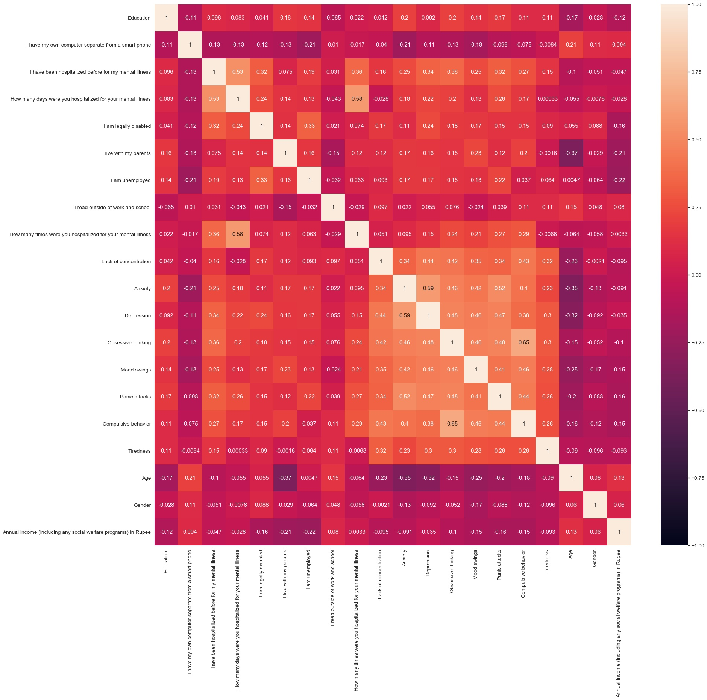
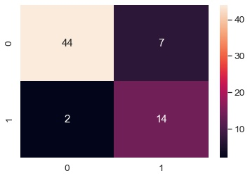

# mantis
## Machine learning Part-

Environment setup-

1- Python 3.7.6

2- Python libraries - pandas,numpy,sklearn,pickle,seaborn,matplotlib

Dataset-
Download data from-
 https://www.kaggle.com/michaelacorley/unemployment-and-mental-illness-survey
 

we use Unemployment and mental illness survey data for this project.
Data Analysis-
we have 31 features in our dataset, now we did feature engineering to find the best classifying features.
Correlation is one of the best way to find the relation in the data, the correlation matrix is 

Now on we will select some best classifying features and use them in building our model.
Now we have to convert the data of some features from string to integer as most of the ml algorithms don't work well with string data.
For this, we will use Labelencoder.
After Labelencoding we have to standardize our data to make its mean to 0 and variance to 1, for this we use StandardScale .

Now Let's try to use different models as the classifier and select the best one based on the accuracy (recall and precision as well).

after some models, we have a Logistic regression Model as best classifier for this dataset,
Confusion matrix for this model is-

its recall score is-0.875 and precision score is-0.66 with accuracy of 86.56716417910447 on test data.

Now we will save Labelencoder,standardscale and model for using it at deploying time.
